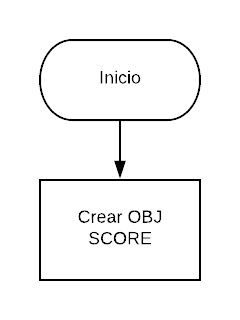

# SCOREKEEPER
### Descripión:

Imagina que estás jugando un juego con algunas amigas y quieres ir registrando el puntaje de cada una. Crea un object llamado scores donde los keys o propiedades son los nombres de tus amigas, y los valores serán los puntajes (todos empiezan con 0).

Escribe una función que toma dos argumentos, el nombre de tu amiga y la cantidad de puntos nuevos que ha obtenido, y que actualice los puntos de la jugadora en el object scores. También escribe una función que imprima en la consola el total de los puntos.

## Pseudocódigo:
### Descripción
El Pseudocodigo me sirve para detallar a grandes razgos los pasos fundamentales de tu codigo a ejecutar.

1.- Definir el objeto *SCORES* en el cual se alamcenara toda la data.

2.- Crear los elementos jugdores que se almacenaran como *keys* en el objeto SCORES.

3.- Agregar el puntaje de cada jugador.

4.- Imprimir el *SCORE* de todos los jugadores.

## Diagrama de flujo

La secuencia grafica de nuestro Pseudocodigo

